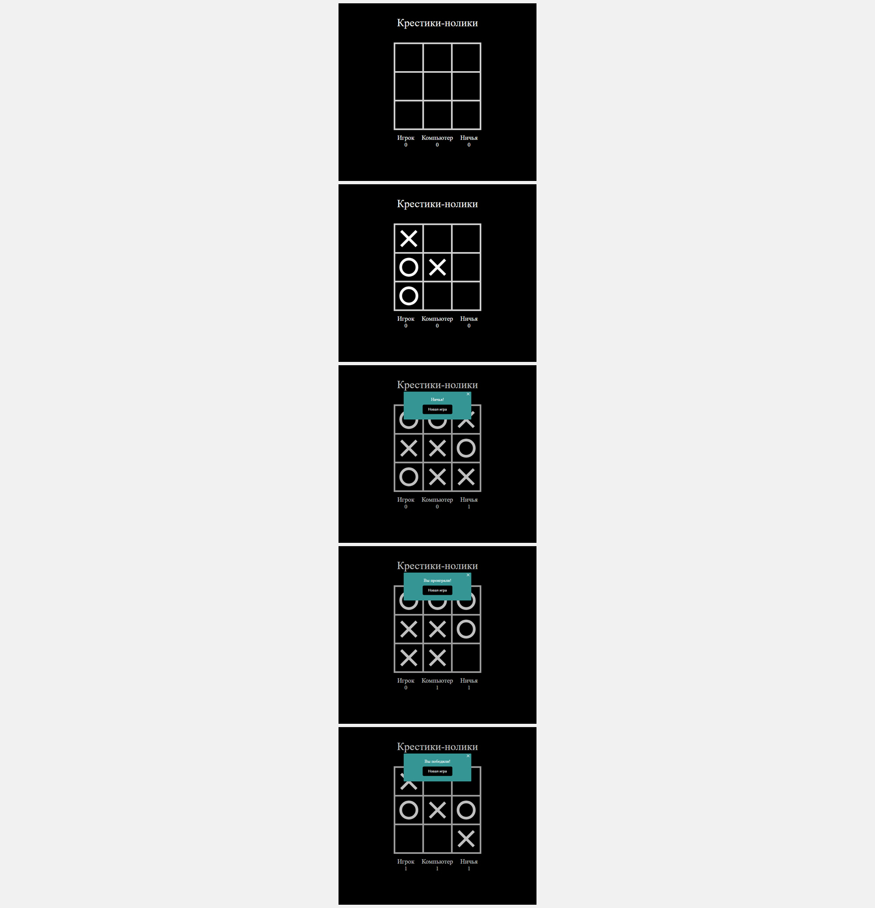

# Игра на Vue.js - "Крестики-нолики"

Проект выполнен в рамках обучения на курсе "Профессия Frontend-Разработчик" в онлайн-школе "Айтилогия".

## Внешний вид

## Выполненные задачи:
- Знакомство с фреймворком Vue.js, его подходами к созданию SPA;
- Практика реализации игры с использованием Vue.js (подход Composition API);
- Реализация логики и механики игры.

## Используемые технологии:
* Vue.js
* HTML
* CSS
* JavaScript